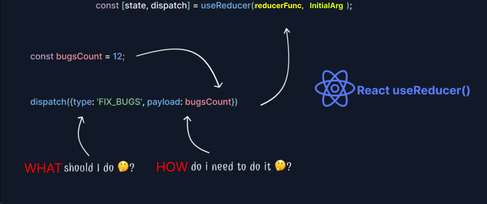

# useReducer



## useReducer
- `useReducer` is a hook that is used for state management in React.
- It is an alternative to `useState`.
- `useReducer` is usually preferable to `useState` when you have complex state logic that involves multiple sub-values or when the next state depends on the previous one.


## Parameters
1. `reducer`: A function that returns the new state based on the previous state and an action.
2. `initialState`: The initial state of the reducer.

```js
const initialState = { count: 0 };

const reducer = (state, action) => {
  switch (action.type) {
    case 'increment':
      return { count: state.count + 1 };
    case 'decrement':
      return { count: state.count - 1 };
    default:
      throw new Error();
  }
};


const [state, dispatch] = useReducer(reducer, initialState);

console.log(state.count); // 0
dispatch({ type: 'increment' });
console.log(state.count); // 1
```

## Return Value
- `state`: The current state.
- `dispatch`: A function that dispatches an action.

